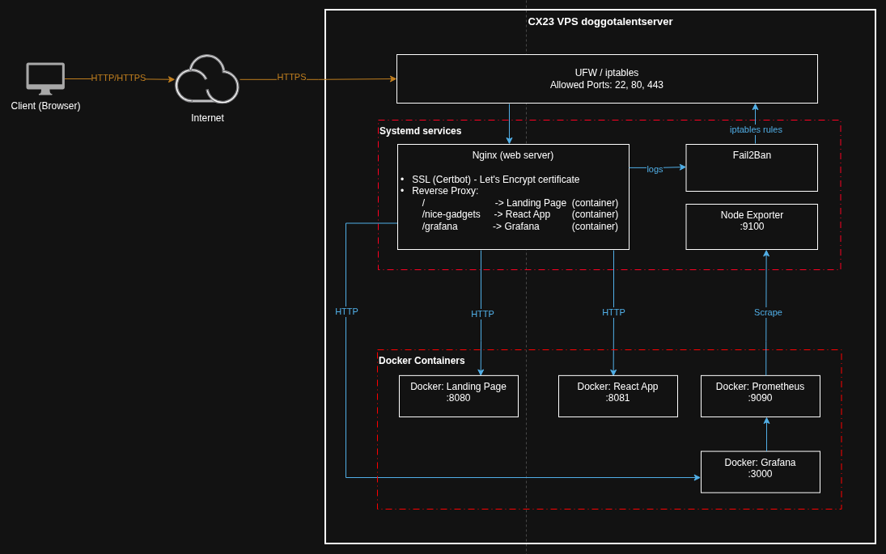

# DoggoTalent Portfolio

A self-hosted DevOps, Linux System Administrator, and Network Engineer portfolio built with Astro and deployed on a Hetzner VPS.

---

## 📄 Description

This landing page showcases my skills and experience in DevOps, system administration, and network engineering. The site is fully self-hosted and includes:

- **Infrastructure**: Ubuntu 24.04.4 LTS with Docker, Nginx, Prometheus, and Grafana.
- **Monitoring**: Real-time system and application monitoring.
- **Projects**: Examples of implemented solutions.
- **Skills**: List of technologies and tools used.

---

## 🌐 Live Demo

Explore the live version of the portfolio:
🔗 [https://doggotalent.xyz](https://doggotalent.xyz)

---

## 📬 Contacts

- **Email**: [martinuc.ilia@gmail.com](mailto:martinuc.ilia@gmail.com)
- **GitHub**: [github.com/doggoTalent](https://github.com/doggoTalent)
- **Telegram**: [@DoggoTalent](https://t.me/doggoTalent)
